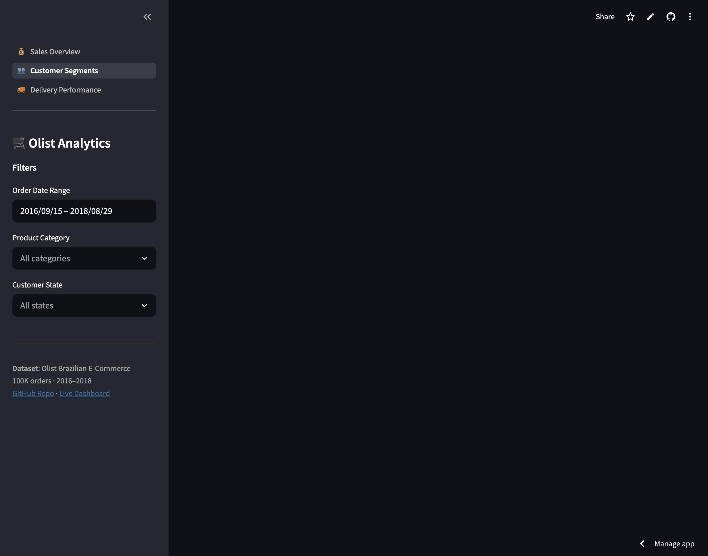

# Olist E-Commerce Analytics Portfolio

**Business Question**: What drives customer retention and delivery performance in Brazilian e-commerce — and what should the business do about it?


---

## Dataset

**Olist Brazilian E-Commerce** (Kaggle) — 100K+ orders across 9 relational tables, September 2016 – August 2018. Real marketplace data with real messiness: missing delivery timestamps, untranslatable product categories, geolocation duplicates, and ~8% repeat customer rate.

---

## Key Findings

1. **Late deliveries cost 1.2 review points** — Late orders average 3.1/5 stars vs 4.3/5 for on-time. The top 5 high-delay states (AM, RR, AC, AP, RO) account for disproportionate customer satisfaction loss.
2. **93% of customers never return** — Repeat purchase rate is ~7-8%, well below the 25-30% e-commerce benchmark. The small repeat segment generates 3-4x the revenue per customer.
3. **3 categories drive ~25% of GMV** — Health & beauty, watches/gifts, and bed/bath/table dominate revenue while maintaining above-average delivery performance.
4. **K-Means identifies 4 actionable segments** — Champions (high RFM), Loyal Customers, At-Risk, and Hibernating. Top 15% of customers by RFM drive a disproportionate share of platform revenue.

---

## Deliverables

| Deliverable | Description |
|-------------|-------------|
| [SQL Analysis](sql/analysis/) | 10 PostgreSQL queries: revenue growth, cohort retention, RFM scoring, seller performance, delivery analysis, and more |
| [EDA Notebook](notebooks/01_eda_cleaning.ipynb) | Data cleaning pipeline, revenue trends, delivery performance, review score analysis |
| [Segmentation Notebook](notebooks/02_customer_segmentation.ipynb) | RFM computation, K-Means clustering, cluster validation, business segment labeling |
| [Interactive Dashboard](https://olist-analytics-portfo-nbpkbqj3vy7dpa2tus56th.streamlit.app) | Live Streamlit app: Sales Overview, Customer Segments, Delivery Performance |
| [Business Memo](docs/business_memo.md) | 1-page analyst memo with executive summary, insights, and recommendations |
| [Data Quality Log](docs/DATA_QUALITY.md) | Cleaning decisions documented per PMC framework |

---

## Project Structure

```
olist-analytics-portfolio/
├── data/
│   ├── raw/              # 9 Olist CSVs (download from Kaggle, git-ignored)
│   └── processed/        # Cleaned Parquet output
├── sql/
│   ├── schema/           # DDL: CREATE TABLE + COPY commands
│   └── analysis/         # 10 business queries (PostgreSQL dialect)
├── notebooks/
│   ├── 01_eda_cleaning.ipynb
│   └── 02_customer_segmentation.ipynb
├── src/
│   ├── data_loader.py    # DuckDB loading + cleaning + parquet export
│   └── ml_pipeline.py    # RFM computation + K-Means pipeline
├── app/
│   ├── main.py           # Streamlit entry point (st.navigation)
│   └── pages/            # Dashboard pages
├── docs/
│   ├── business_memo.md
│   └── DATA_QUALITY.md
└── requirements.txt
```

> **SQL note**: All queries use PostgreSQL dialect and run on DuckDB locally (zero config). Portable to a live PostgreSQL instance with no changes.

---

## Setup

```bash
# 1. Clone and install
git clone https://github.com/ChunkyTortoise/olist-analytics-portfolio
cd olist-analytics-portfolio
pip install -r requirements.txt

# 2. Download Olist dataset from Kaggle
# https://www.kaggle.com/datasets/olistbr/brazilian-ecommerce
# Place all 9 CSV files in data/raw/

# 3. Build the master parquet
python -c "from src.data_loader import clean_and_export; clean_and_export()"

# 4. Launch the dashboard
streamlit run app/main.py

# 5. (Optional) Run SQL queries via DuckDB
python -c "
import duckdb
from src.data_loader import load_all_tables
con = load_all_tables()
result = con.execute(open('sql/analysis/01_monthly_revenue_growth.sql').read()).df()
print(result.head())
"
```

---

## Screenshots



**Sales Overview** — KPI cards, monthly revenue trend (R$ 13.3M across 96K orders), revenue by category and state.

**Customer Segments** — RFM K-Means clustering (k=4): Champions, Loyal, At-Risk, Hibernating. PCA 2D projection + segment distribution.

**Delivery Performance** — 7.9% late delivery rate, 12.4 day avg delivery, review score gap: 4.21 on-time vs 2.55 late.

---

## About

Built by **Cayman Roden** as a data analyst portfolio project.  
Domain: E-commerce analytics | Stack: Python · SQL · Streamlit  
[LinkedIn](https://www.linkedin.com/in/caymanroden/) · [GitHub](https://github.com/ChunkyTortoise/olist-analytics-portfolio)
